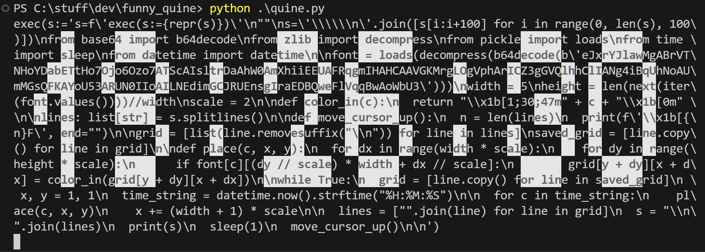

# Quine clock (Python)

Quine that is also a clock + quine generator.

[This code](./quine.py)
```Python
exec(s:='s=f\'exec(s:={repr(s)})\'\n""\ns=\'\\\\\\n\'.join([s[i:i+100] for i in range(0, len(s), 100\
)])\nfrom base64 import b64decode\nfrom zlib import decompress\nfrom pickle import loads\nfrom time \
import sleep\nfrom datetime import datetime\n\nfont = loads(decompress(b64decode(b\'eJxrYJlawMgABrVT\
NHoYDabETtHo7Ojo6Ozo7ATScAIsltrDaAhW0AmXhiiEEUAFRqgmIHAHCAAVGKMrgLOgVphArICZ3gGVQlhhClIANg4iBqUhNoAU\
mMGsQFKAYoU53ARUN0IIoAILNEdimGCJRUEnsgIraEDBQweFlVqqBwAoWbU3\')))\nwidth = 5\nheight = len(next(iter\
(font.values())))//width\nscale = 2\n\ndef color_in(c):\n  return "\\x1b[1;30;47m" + c + "\\x1b[0m" \
\n\nlines: list[str] = s.splitlines()\n\ndef move_cursor_up():\n  n = len(lines)\n  print(f\'\\x1b[{\
n}F\', end="")\n\ngrid = [list(line.removesuffix("\\n")) for line in lines]\nsaved_grid = [line.copy\
() for line in grid]\n\ndef place(c, x, y):\n  for dx in range(width * scale):\n    for dy in range(\
height * scale):\n      if font[c][(dy // scale) * width + dx // scale]:\n        grid[y + dy][x + d\
x] = color_in(grid[y + dy][x + dx])\n\nwhile True:\n  grid = [line.copy() for line in saved_grid]\n \
 x, y = 1, 1\n  time_string = datetime.now().strftime("%H:%M:%S")\n\n  for c in time_string:\n    pl\
ace(c, x, y)\n    x += (width + 1) * scale\n\n  lines = ["".join(line) for line in grid]\n  s = "\\n\
".join(lines)\n  print(s)\n  sleep(1)\n  move_cursor_up()\n\n')
```
prints itself, colored such that it displays time as well.


Inspired by [tsoding video](https://www.youtube.com/watch?v=plFwBqBYpcY) that was inspired by [this tweet](https://x.com/aemkei/status/1795762928399880680)

To make this, I wrote a quine generator for Python. It can generate things like this (see [`code_to_execute.py`](./code_to_execute.py)) as well as quines without exec (but they are uglier).

[`main.py`](./main.py) is the generator which takes code from `code_to_execute.py` (which can reference the future quine code as `s`) and packages it as `quine.py`. If you insert simple `print(s)` it will generate the classical quine.

To use the generator, install `questionary` first: `pip install questionary`

